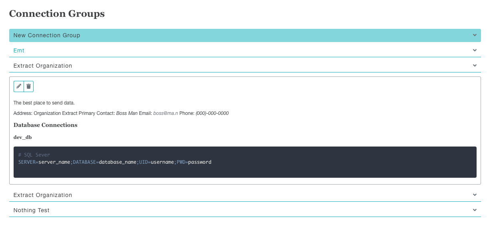

..
    Atlas of Information Management
    Copyright (C) 2020  Riverside Healthcare, Kankakee, IL

    This program is free software: you can redistribute it and/or modify
    it under the terms of the GNU General Public License as published by
    the Free Software Foundation, either version 3 of the License, or
    (at your option) any later version.

    This program is distributed in the hope that it will be useful,
    but WITHOUT ANY WARRANTY; without even the implied warranty of
    MERCHANTABILITY or FITNESS FOR A PARTICULAR PURPOSE.  See the
    GNU General Public License for more details.

    You should have received a copy of the GNU General Public License
    along with this program.  If not, see <https://www.gnu.org/licenses/>.

.. _connections:

***********
Connections
***********

EM2's connection manager stores credentials for FTP, SFTP, SMB, SSH, Database and GPG encryption keys.

Connections are saved in "Connection Groups called "Organizations" in the Task pages.

A connection group can have any number of different connections.

Password/ssh key/gpg key fields are all encrypted before being saved into the backend database.

