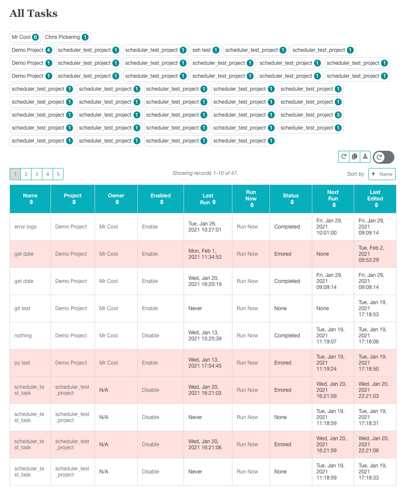
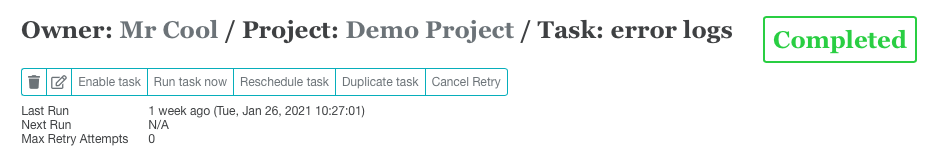

*****
Tasks
*****

A task is child to a project and contains the details of the job to be run. A typical task will run a sql query, format the results with a delimiter and then upload the file into a SFTP server.

Tasks include three primary pages:

- All Tasks. This loads a paginated table of all tasks along with a name cloud of task owners (owners come from the project level), and also a name cloud of the associated projects.
- My Tasks. This loads a paginated table of all tasks along with a name cloud of the associated projects.
- Task Details. Summary page of all the task details, a few controls, and the run history.
- New Task. The page to create or edit tasks.

.. _task_details:

Task Details
############

From the task details a task can be

- Deleted
- Edited
- Run Now
- Rescheduled. This option will remove any existing schedules from the Scheduler API and recreate them.
- Duplicated. This option will clone the job in a disabled state.
- Cancel Retry. If the task has failed and and retry has been scheduled the user can click here to prevent the retries. This option cannot be clicked while task is running.

Following this most task details are listed along with a log, and a listing of historical file outputs.

The history files can be downloaded or resent to the *current* destination.

.. _task_new:

New Task
########

There are many options for creating new tasks!

Retries
=======

If a task has a non-catastrophic failure, meaning that the app is still running and the error has been logged, we have the option to attempt multiple retries. This is especially useful when uploading files into SFTP's where you cannot control the upload speeds etc, and may be subject to upload errors.

In cases like this it is advisable to allow the task to rerun.

Data Sources
============

Most of the data source/ destination options are fairly consistent through all the option groups.

Data sources must first be created in the :ref:`connections`.

Database
--------

A source organization and database can be selected.

The option "Include Query Headers" will include/exclude column headings from the output.

A query location must be chosen. The query can be loaded from SFTP, FTP, SMB, Gitlab, WebURl (for example, github + access token), or can be entered directly into EM2.

.. note:: Queries will be modified at runtime. A preview of the modifications is available on the Task Details page. For example, "using" statements are not allowed in ODBC, so tables must be fully qualified, or a db specified in the connection. EM2 will automatically remove unauthorized statements in SQL queries.

Query Parameters can be added. These will override what is set at the project level and will follow the same format. See :ref:`project_parameters`

SQL Server queries will do a row count as the queries run and will log the current row count to the task log.

FTP/SFTP/SMB
------------

These data source options allow a remote file to be loaded and sent to a destination. This is a nice option if a file must be reformatted.

For example a csv can be loaded and changed to a pipe delimited file.

.. note:: wildcards can be used in filenames. For example: "\*this.csv" will match "and_this.csv". Use with caution as only a single file will be loaded even if there are multiple matches.

Python Script
-------------

While a python script can be run as an add-on to any data source (through `Processing Script`_), if you only wish to run a python script and not have any other data source you can choose this option.

SSH
---

If you only need to schedule a command to run on a remote server this is the option to use.

It will attempt to connect to a remote server through SSH and run whatever command you specify.

The commands can be loaded from an exteral script (through SFTP, FTP, SMB, Gitlab or web url), or internally through the code editor.

Processing Script
=================

Data from the source is passed into a local file and can be modified with a python script.

Also, if you choose `Python Script`_ you can run a python script without input.

If there is a data source selected it will be passed into your python script as parameter 1.

A script like this will pick up that file.

.. code:: python

    import sys
    input_file = sys.argv[1]

All processing scripts are run in their own environment and dependencies are automatically installed as needed.

The Processing Script can be loaded from a multitude of places. You can load a multi file package and choose what file to run as well.

Data Destination
================

Once data is gather is can be sent out!

First set the output file type and name. The file name can use python type data parameters. They also support additional manipulations that are not part of the standard python syntax.

For example, if you want to include the day yesterday in your filename you can do

.. code:: python

    nice_name_yesterday_%d-1.csv

The '%d-1' will parse out to the day number yesterday.

If needed, the file can be sent inside a zip folder.

Additional characters can be appended to each line in the file.

File Encryption
===============

Files can be encrypted using a gpg key. Check the box to run encryption on and pick the encryption key from the dropdown.

Filenames will be preserved and ".gpg" appended to the current extension. Files will be encrypted before zipping if the zip option is selected.

md5 Hash
========

After creating the file, and optionally encrypting the file, a md5 hash of the file is created and save along with the file name, file size, etc, for future file verification.

SFTP/SMB/FTP
------------

The output file can be loaded into an existing connection.

There is an option to attempt to replace existing files with the same name, however this option is also set on the SFTP server level and may conflict.

Email
-----

Getting a success/failure email from the extract can be useful. You have the option to attach or embed the output file to the email as well. Use with caution if you are querying sensitive data, or have a file that may exceed or email size limit.

Finally,

There is an option to enable the task immediately. If this is checked then the task will be picked up an run next time the project is triggered by the Scheduler API.
