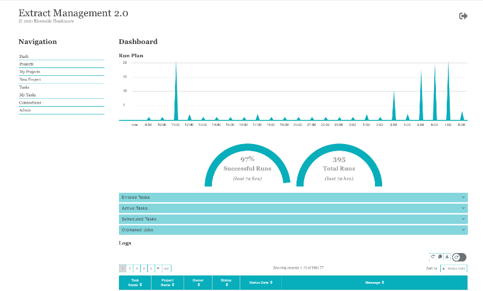

..
    Extract Management 2.0
    Copyright (C) 2020  Riverside Healthcare, Kankakee, IL

    This program is free software: you can redistribute it and/or modify
    it under the terms of the GNU General Public License as published by
    the Free Software Foundation, either version 3 of the License, or
    (at your option) any later version.

    This program is distributed in the hope that it will be useful,
    but WITHOUT ANY WARRANTY; without even the implied warranty of
    MERCHANTABILITY or FITNESS FOR A PARTICULAR PURPOSE.  See the
    GNU General Public License for more details.

    You should have received a copy of the GNU General Public License
    along with this program.  If not, see <https://www.gnu.org/licenses/>.

|python-version| |travis| |codecov| |climage|

Extract Management 2.0
======================

Extract Management 2.0 is a task scheduling tool for getting data from a source and depositing it in a destination - sql servers to SFTP servers.

Tasks can run at any time and on any schedule.

Checkout the `demo site <https://extract-management.herokuapp.com>`_!
Or, you can run your own docker image:

.. code:: sh

    docker run -i -t -p 5003:5003 -e PORT=5003 -u 0 christopherpickering/extract_management:latest
    # access on http://localhost:5003

Check out our `documentation site <https://riverside-healthcare.github.io/extract_management/>`_.

How To Use?
-----------

EM2 is a three part server:

- web app
- scheduler
- job runner

EM2 runs with Nginx + Gunicorn. Three individual web services are created, the web app is the public web site and the other two (scheduler and runner) are internal API's running on the web server.

Prerequisites
~~~~~~~~~~~~~

- Currently EM2 is setup to install on an Ubuntu server, however with a few tweaks to the install script it will work well on most Linux.
- curl or wget should be installed
- Ideally, you will have your own git repository, holding updated config files, and will publish from there.

Installation
~~~~~~~~~~~~

An install script is provided to easily install EM2 onto your Ubuntu server. Update the ``publish/install.sh`` file "dns" value to be the dns of your server, and the "remote" to point to your repo path. If you plan to use ssl you can add the certs into the ``publish`` folder as well. Use names "cert.crt" and "cert.key".

The publish takes place over SSH from a git server. It is possible to use an accesskey when publishing from fabric.

Update username and hostname with your planned login. Commands require sudo. ``sudo bash...``

+----------+----------------------------------------------------------------------------------------------------------------------------------+
| Method   | Command                                                                                                                          |
+==========+==================================================================================================================================+
| fabric   | ``cd publish && fab publish && cd ..``                                                                                           |
+----------+----------------------------------------------------------------------------------------------------------------------------------+
| curl     | ``bash -c "$(curl -kfsSL https://raw.githubusercontent.com/Riverside-Healthcare/extract_management/main/publish/install.sh)"``   |
+----------+----------------------------------------------------------------------------------------------------------------------------------+
| wget     | ``bash -c "$(wget -O- https://raw.githubusercontent.com/Riverside-Healthcare/extract_management/main/publish/install.sh)"``      |
+----------+----------------------------------------------------------------------------------------------------------------------------------+

After cloning the repo the ``install.sh`` script will install all packages necessary to start up the app.

Running EM2 Locally
~~~~~~~~~~~~~~~~~~~

EM2 can be run locally. We use pyenv and poetry to manage the project dependencies. Assuming you will too -

.. code:: sh

    pyenv local 3.9.0
    poetry install

    # have you already created a database "em_web_dev" and updated the config files?
    FLASK_APP=em_web
    flask db init
    flask db migrate
    flask db upgrade
    flask seed
    # if you want some basic demo information added
    flask seed_demo

Finally, to run the three site, you will need to run each command in a separate termimal session:

.. code:: sh

    FLASK_ENV=development && FLASK_DEBUG=1 && FLASK_APP=em_web && flask run
    FLASK_ENV=development && FLASK_DEBUG=1 && FLASK_APP=em_scheduler && flask run --port=5001
    FLASK_ENV=development && FLASK_DEBUG=1 && FLASK_APP=em_runner && flask run --port=5002

Other Configuration Tips
~~~~~~~~~~~~~~~~~~~~~~~~

If you use hostnames vs IP addresses in your config files be sure to update hosts file ``nano /etc/hosts`` to include the ip address of any internal domain hosts you will use. For example, LDAP server, GIT server, any databases you plan to query, etc.

About the App
-------------

How Login Works
~~~~~~~~~~~~~~~

Login is done through LDAP and follows this basic process Note: the python package python-simpleldap has been customized slightly to work with our ldap setup.

1. config.py file holds the general connection info. A connection to the ldap server is made with the user credentials supplied in the config file.
2. Once a connection is established and a user attempts to access the site the simpleldap package first verifies that the user exists, by doing a search for the user. If the user exists we save their details and groups.
3. If the user exists then we attempt to log them in.. this returns true if they had a valid username/pass.
4. Finally, as this site is restricted to Analytics group users, we only allow users that have the "Analytics" group on their profile.

.. note:: once logged in the user\_id is kept in the server "session". When a user logs out we just drop the user\_id from the session.

Data Flow
~~~~~~~~~

Project name and schedule are created > tasks can be added to the project.

Task are completely independent, the order of tasks is not respected and tasks may run in parallel. The purpose of allowing multiple tasks is to keep a clean grouping of tasks that belong to the same data project.

The tasks in a job can individually be started or stopped.

Testing
~~~~~~~

Code (python/javascript/css/html) is all tested with tox:

.. code:: sh

    tox

Webserver Info
~~~~~~~~~~~~~~

EM2 uses three web services for a few reasons -

- Splitting the UI from the running tasks improves the user experience
- The scheduler must run on only 1 web worker, while we would like as many workers as possible for the runner.
- API's are cool.

In the EM2 admin screen there is an option to retart the web services. For this option to work you may need to give you webapp user sudo permission, or:

.. code:: sh

    sudo visudo

    # add this line to the end.. assuming the webapp usergroup is "webapp"
    %webapp ALL=NOPASSWD: /bin/systemctl daemon-reload
    %webapp ALL=NOPASSWD: /bin/systemctl restart *

If you will have "long running" tasks, it may be wise to increase the nginx timeout. (Gunicorn timeouts are already increased in the app install files.)

.. code:: sh

    # open nginx config
    sudo nano /etc/nginx/nginx.conf

    # add these in the http secion. all for good luck...
    fastcgi_connect_timeout 999s;
    proxy_connect_timeout 999s;
    proxy_read_timeout 999s;

Credits
-------

Atlas was created by the Riverside Healthcare Analytics team -

- Paula Courville
- `Darrel Drake <https://www.linkedin.com/in/darrel-drake-57562529>`_
- `Dee Anna Hillebrand <https://github.com/DHillebrand2016>`_
- `Scott Manley <https://github.com/Scott-Manley>`_
- `Madeline Matz <mailto:mmatz@RHC.net>`_
- `Christopher Pickering <https://github.com/christopherpickering>`_
- `Dan Ryan <https://github.com/danryan1011>`_
- `Richard Schissler <https://github.com/schiss152>`_
- `Eric Shultz <https://github.com/eshultz>`_

.. |python-version| image:: https://img.shields.io/badge/Python-3.7%20%7C%203.8%20%7C%203.9-blue
   :target: https://analyticsgit.riversidehealthcare.net/extract-management/extract-management-site/-/commits/master

.. |travis| image:: https://travis-ci.com/Riverside-Healthcare/extract_management.svg?branch=main
    :target: https://travis-ci.com/Riverside-Healthcare/extract_management

.. |codecov| image:: https://codecov.io/gh/Riverside-Healthcare/extract_management/branch/main/graph/badge.svg
  :target: https://codecov.io/gh/Riverside-Healthcare/extract_management

.. |climage| image:: https://api.codeclimate.com/v1/badges/7dffbd981397d1152b59/maintainability
   :target: https://codeclimate.com/github/Riverside-Healthcare/extract_management/maintainability
   :alt: Maintainability
